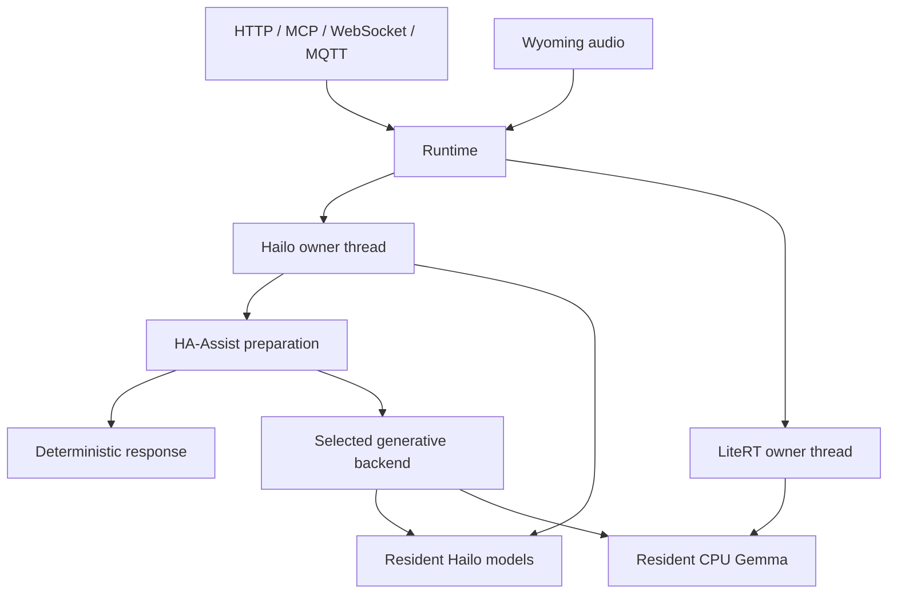

# Technical architecture and source map

The service keeps inference models resident and exposes them through HTTP,
OpenAI chat/SSE, WebSocket, MCP, Wyoming and MQTT. Object detection additionally
supports Frigate's ZeroMQ detector protocol. This document describes the internal
source layout; [api.md](api.md) specifies the public interfaces and
[installation.md](installation.md) describes deployment.

## Naming and ownership

`backend_<runtime>.py` owns native resources and synchronous model execution.
`chat_<runtime>[_<role>].py` adapts a chat request to the runtime's input and output
contract. `chat_common.py` holds model-independent Hailo prompt and validation
logic. `diagnostics*.py` handles instrumentation. `ha_*.py` implements the
Home Assistant domain. A model brand is configuration, rather than part of a
shared utility's identity: Gemma runs in `backend_litert.py`, while Qwen and other
native GenAI models run in `backend_hailo.py`.

`__init__.py` has no initialization side effects. Importing the package does not
patch classes or replace routing functions. Constructors retain dependencies;
`start()` explicitly loads native resources, and `close()` releases them.
The native SDK imports remain deferred until their backend starts.

## Request and concurrency model

`Runtime` keeps separate single-worker executors and pending counters for Hailo
and LiteRT. Each model is started, called and closed on its owner thread.
Whisper and MiniLM share the Hailo generative executor. LiteRT can run concurrently
on CPU. The detector has its own owner executor and SHARED Hailo device.
Client timeouts and disconnections do not free capacity until native work
actually completes; submitted work is shielded from premature cancellation.

A normal explicit LLM/VLM request goes to its selected backend. `HA-Assist`
first selects a valid configured text/vision target. `ha_assist.prepare()` runs
on the Hailo owner thread so semantic retrieval is serialized. It returns either
a direct response or a prepared request for one generative backend. Image
requests retain image content and bypass text-only deterministic answers.

## Explicit Home Assistant preparation

`HailoBackend.select_tools()` calls `ha_pipeline.prepare_request()`.
The boundary checks HA provenance, handles current-turn history, resolves
catalogue spelling, establishes the response language, validates deterministic
HassIL/numeric actions and handles clarification/tool failures.

When that boundary needs fallback processing, stages are composed explicitly.
The sequence below is the call order, rather than package-import order:

1. `ha_weather_routing.prepare_request`: weather/ambient data and read-only lookups.
2. `ha_prompt_compiler.prepare_request`: call the remaining stages, then compile
   a compact prompt if inference is still needed.
3. `ha_action_verification.prepare_request`: preserve the live-state tool needed
   for completed on/off actions.
4. `ha_state_routing.prepare_request`: deterministic state answers, direct
   GetLiveContext calls or minimal live-result follow-ups.
5. `ha_routing.prepare_request`: relevance gating and general-conversation passthrough.
6. `HailoBackend.retrieve_context`: lexical/MiniLM entity and tool retrieval.

Stages accept `(backend, request, next_stage)` and return a `ChatRequest`.
A stage may finish a route early. The compiler and verification stages also
post-process the request returned by their fallback. `ha_pipeline` adds the
language instruction and preserves the request plan after the stages complete.
This retains the established precedence without replacing class methods.

## Chat contracts and budgets

`ChatBackend` in `interfaces.py` specifies `start`, `chat` and `close` for
injected resident backends. `ChatResult` is text or a validated assistant-message
mapping; `ChatEmitter` receives text chunks or complete validated messages.
A request contains ordered messages, tool schemas and generation policy.
Request-local metrics and routing plans travel with its copies.

Both native Hailo roles use `chat_common`: tool history validation, compact
function signatures, strict sandboxed template rendering, native token counting,
whole-turn trimming and generated-call validation. The VLM adapter retains image
placeholders. The LLM adapter rejects images and converts messages to native
text. `BudgetedPrompt` carries the accepted request, messages and rendered text;
the LLM uses that exact measured string without rendering its template twice.

LiteRT has its own native conversation/tool contract. `backend_litert._limit_input`
counts the complete rendered final-message prompt, including native history and
tools, and retains conservative headroom. It removes complete old turns only.
The default LiteRT input cap remains 4096. Required system/tool context and the
active tool round are not truncated. `InputBudgetError` produces a structured
HTTP client error when required content cannot fit.

Function calls are returned to the requesting client for execution. Neither
native tool declarations nor deterministic routing execute Home Assistant
actions in this service. Generated calls must pass name, argument-schema and
HA target/value validation before being returned or streamed.

## Python file map

All paths below are relative to `src/hailo_services/`.

| File | Responsibility and principal entry points |
| --- | --- |
| `__init__.py` | Package identity; no backend initialization or monkey patches. |
| `__main__.py` | Logging, settings and single-worker uvicorn startup via `main`. |
| `app.py` | FastAPI/MCP composition, ASGI access/body limits, lifecycle, UI assets, exception mapping, HTTP chat/SSE, transcription, detection and WebSocket routes. |
| `config.py` | Frozen `Settings`; YAML/environment loading, model identifiers and configuration validation. |
| `schemas.py` | Pydantic `ChatRequest`, `TranscribeRequest`, `SpeechRequest`, `VisionDetectRequest` and field validators. |
| `interfaces.py` | Structural `ChatBackend` contract; shared `ChatResult` and `ChatEmitter` types. |
| `errors.py` | Backend-independent queue/unavailability and native LiteRT inference errors. |
| `runtime.py` | Async backend lifecycle, routing, independent queues, cancellation-safe execution, streaming and readiness/model metadata. Re-exports backend/error classes for existing imports. |
| `backend_hailo.py` | Resident SHARED VDevice and native model ownership; delegates Whisper creation/transcription to `speech_hailo_whisper.py`, and chat to the chat adapters. |
| `backend_litert.py` | Resident CPU Gemma/LiteRT engine, conversation/tool adaptation, exact input budgeting, synchronous/streamed generation and native failure translation. |
| `speech_common.py` | Backend-independent language matching shared by speech adapters and Wyoming voice selection. |
| `speech_piper.py` | CPU Piper adapter, installed voice discovery, model/language selection, bounded audio generation and WAV/PCM encoding. |
| `speech_hailo_whisper.py` | Native Whisper model creation on the existing SHARED device and transcription of normalized audio. |
| `speech_runtime.py` | Independent bounded TTS owner queue, readiness, client deadlines and CPU model lifecycle; shared by HTTP and Wyoming. |
| `chat_common.py` | Shared Hailo tool contract/history adaptation, strict Jinja template rendering, `BudgetedPrompt`, tokenizer budgeting and validated output parsing. |
| `chat_hailo_llm.py` | Text-only native LLM adapter; image rejection, exact measured string and XML-wrapped tool output handling. |
| `chat_hailo_vlm.py` | VLM-facing exports of common logic preserving visual placeholders. |
| `chat_litert.py` | Successful HA action acknowledgement before LiteRT generation and request-scoped timing correlation. |
| `diagnostics.py` | Shared structured JSON debug-event logger. |
| `diagnostics_litert.py` | Native engine/conversation proxies measuring creation, initialization, generation and first text chunk; debug rendered prompt and scoped timing metadata. |
| `metrics.py` | UTC millisecond timestamps, finite metric recording, retokenized output counts and final response timing. |
| `input_budget.py` | Whole-turn history candidates and `InputBudgetError`; retains required active tool dependencies. |
| `tool_calling.py` | OpenAI/native tool validation and conversion, local schema-reference checks, history dependency matching, target normalization and output-call validation. |
| `tool_retrieval.py` | Corpus-weighted lexical and optional MiniLM ranking, static entity compaction, relevant enum pruning and bounded embedding caching. |
| `json_utils.py` | Shared non-throwing JSON-object parser for arguments and tool results. |
| `ha_assist.py` | Virtual-model target validation and the deterministic-or-generative preparation boundary. |
| `ha_pipeline.py` | HA provenance, task history, numeric actions, deterministic validation, localization and explicit stage composition. |
| `ha_intents.py` | Official HassIL grammars restricted to client tools and actual catalogue slots; exact and conservative fuzzy recognition. |
| `ha_fuzzy.py` | Catalogue-only spelling candidate rankings and uniquely justified slot repairs. |
| `ha_request_plan.py` | Cached catalogue, canonical slots, ambiguity plan, failure/clarification responses and semantic action validation. |
| `ha_routing.py` | Lexical/semantic HA relevance with confidence separation, general-conversation passthrough, explicit on/off target logic and routing stage. |
| `ha_state_routing.py` | Static/live entity parsing, area-before-global-name targeting, lookup errors, deterministic state/measurement answers and safe live-context fallbacks. |
| `ha_weather_routing.py` | Weather/ambient source selection, coherent live-state answers and minimal environment interpretation fallback. |
| `ha_action_verification.py` | Deterministic on/off state verification, one retry, live-tool preservation and successful client action acknowledgement. |
| `ha_prompt_compiler.py` | Request-specific capabilities, targets and tool schemas; selected-tool semantic guards and preservation of compatible client domain enums. |
| `i18n.py` | Request-local language context, cached external catalogues, multilingual matching vocabulary, labels and wait sentences. |
| `models.py` | Catalogue roles, compatible Hailo releases, bounded atomic artifact downloads and cached artifact resolution. |
| `minilm.py` | Host tokenizer/embedding weights, resident Hailo encoder, masked pooling and normalized retrieval vectors. |
| `media.py` | Bounded base64 decoding, writable model-sized RGB frames, supported audio containers and 16 kHz mono normalization. |
| `protocols.py` | Wyoming discovery/PCM handling, bounded event reads, common operation dispatch and MQTT request/response bridge with reconnect. |
| `vision.py` | Resident SHARED detector and its executor, letterboxing, NMS/YOLO26 decoding, source-coordinate mapping and health metadata. |
| `vision_zmq.py` | Frigate-compatible ZeroMQ model probes and `(20, 6)` float32 tensor responses; model uploads remain server-disabled. |
| `preflight.py` | Service-namespace write/rename probes before importing native Hailo SDKs. |
| `tls.py` | Local CA/server certificate generation/reuse, certificate validation, client trust profiles and nginx proxy configuration. |

The former `ha_state_routing_fixes.py` and `ha_semantic_routing_fixes.py` were
removed. Their behavior now lives directly in the state router, relevance router
and prompt compiler. Existing regression tests continue to exercise it.

## Resources, browser code and deployment

| Path | Responsibility |
| --- | --- |
| `src/hailo_services/model_catalog.yaml` | Model IDs, roles, releases, artifact sizes, context/image limits and native template options. |
| `src/hailo_services/locales/{de,en,ru}.json` | UI text, routing vocabulary, response labels and localized notifications. |
| `src/hailo_services/web/index.html` | Status, chat, image and speech playground markup. |
| `src/hailo_services/web/style.css` | Responsive UI layout and visual presentation. |
| `src/hailo_services/web/app.js` | UI localization, model switching/history, authenticated requests, metrics and microphone/file capture. |
| `src/hailo_services/web/recorder-worklet.js` | Silent audio worklet averaging microphone channels and transferring mono PCM. |
| `pyproject.toml` | Package metadata, dependencies, console entry point, package resources and test/lint/documentation conventions. |
| `Dockerfile`, `compose.yaml` | Container image and deployment including native vendor packages/device access. |
| `deploy/hailo-10h-services.service` | Native systemd service lifecycle and filesystem permissions. |
| `deploy/hailo-10h-services.env.example` | Environment configuration example. |
| `deploy/hailo-10h-services.yaml.example` | Structured YAML model/backend configuration example. |
| `deploy/vendor/README.md` | Placement of user-provided native DEB/wheel packages. |
| `scripts/install.sh` | Native application/dependency installation. |
| `scripts/update.sh` | Existing installation update. |
| `scripts/install-proxmox-lxc.sh` | Proxmox ARM64 LXC provisioning, native package placement and device mapping. |
| `scripts/enable-https.sh` | TLS/proxy provisioning and HTTPS enablement. |
| `scripts/disable-https.sh` | HTTPS/proxy disablement. |
| `scripts/uninstall.sh` | Service removal while retaining the documented model artifacts. |
| `.github/workflows/test.yml` | Python version matrix, lint/docstring/format checks, regression tests, browser tests and shell syntax validation. |

## Documentation and extension rules

Every production Python module, class, function and method has a docstring,
including nested callbacks. Google-style `Args`, `Returns`/`Yields` and `Raises`
sections describe parameters, units, return contracts and relevant failure
conditions. Predicates and pure transformations document that valid inputs do
not raise application-specific exceptions. Class attributes describe schema and
settings fields. Runtime SDK types remain dynamic where HailoRT/LiteRT versions
vary; central chat interfaces and public model schemas have explicit annotations.

Formatting follows Ruff/PEP 8 with the repository's 100-character code width.
Docstrings follow PEP 257. Ruff checks missing docstrings and argument
coverage for production Python; `tests/test_architecture.py` additionally guards
shared prompt behavior and package-import ownership. See
[docstring-style.md](docstring-style.md) for authoring examples and IDE setup.

To add a chat runtime, implement the `ChatBackend` contract in a new backend
module, add its chat adapter, then extend configuration, catalogue and Runtime
routing. Keep lifecycle on a dedicated owner thread. To add an HA preparation
stage, implement the same `(backend, request, next_stage)` contract and insert it
in `ha_pipeline.prepare_request` with an explicit precedence. Add regression
cases for deterministic paths, ambiguity, tool-policy constraints and fallback.
Do not install new behavior by modifying another class at import time.

The former compatibility modules have been removed. Python integrations must
use the canonical imports below; the old module paths are no longer available.

| Removed module | Canonical module(s) |
| --- | --- |
| `hailo_services.hailo_llm_chat` | `hailo_services.chat_hailo_llm` |
| `hailo_services.vlm_chat` | `hailo_services.chat_hailo_vlm` |
| `hailo_services.litert_optimizations` | `run_chat` in `hailo_services.chat_litert`; `instrument_engine` in `hailo_services.diagnostics_litert`; `successful_action_followup` in `hailo_services.ha_action_verification` |

Public HTTP endpoints, environment/YAML settings and model IDs retain their
existing contracts.

## Test file map

| File under `tests/` | Main regression coverage |
| --- | --- |
| `test_architecture.py` | Side-effect-free imports, backend ownership, one-time prompt rendering, absence of removed compatibility modules and production return documentation. |
| `test_services.py` | HTTP/SSE/WebSocket/MCP, Wyoming wire protocol, MQTT, residency, queue cancellation and model-version detection. |
| `test_hailo_llm.py` | Native text LLM selection, templates, budgets and model lifecycle. |
| `test_vlm_chat.py` | VLM text/image prompts, budgets, tool parsing and routing. |
| `test_vlm_compact_tool_contract.py` | Compact function signatures and validated Qwen output. |
| `test_vlm_prompt_template_regression.py` | Native Qwen/Llama template compatibility and special token policy. |
| `test_input_budget.py` | Native input counting, whole-turn trimming and diagnostic traces. |
| `test_tool_calling.py` | Schemas, tool history, native translation and generated action validation. |
| `test_litert_optimizations.py` | Successful HA acknowledgement, native timing proxies and prompt diagnostics. |
| `test_ha_assist.py` | Virtual model routing, deterministic behavior and isolation from ordinary model requests. |
| `test_ha_routing.py` | HA relevance, general passthrough and deterministic actions. |
| `test_ha_state_routing.py` | Direct live lookups, state questions and live-result answers. |
| `test_ha_state_routing_fixes.py` | Area precedence, generic names, unknown rooms and lookup failures. |
| `test_ha_measurement_fixes.py` | Live measurement handling and source-selection regressions. |
| `test_ha_semantic_routing_fixes.py` | Semantic ambiguity, selected capability families and compatible domain enums. |
| `test_ha_weather_routing.py` | Coherent weather/ambient data and minimal environmental fallbacks. |
| `test_ha_action_verification.py` | Deterministic state verification and single retry after accepted actions. |
| `test_ha_prompt_compiler.py` | Request-specific HA system prompts, entity selection and compact schemas. |
| `test_ha_prompt_compiler_turn_actions.py` | TurnOn/TurnOff capability preservation during compilation. |
| `test_i18n_pipeline.py` | Multilingual deterministic routing, slot handling and language context. |
| `test_minilm_model.py` | Host embeddings, tokenizer assets and native encoder setup. |
| `test_model_config.py` | YAML/environment model settings, IDs and per-role enablement. |
| `test_model_catalog_supported.py` | Bundled model catalogue metadata and supported releases. |
| `test_vision.py` | Detector preprocessing, output decoding, HTTP and ZeroMQ handshake/tensors. |
| `test_tls.py` | Certificate reuse, trust profiles and proxy settings. |
| `test_preflight.py` | Writable service directories and startup probes. |
| `test_deployment.py` | Compose/LXC/native packaging and device/dependency provisioning. |
| `test_web.cjs` | Browser recording, request metrics, model switching and retained history. |

Native model tests use fake SDK bindings rather than hardware. The ZeroMQ IPC
integration test is skipped only when the execution environment rejects socket
binding with `EPERM`; other binding errors still fail the test.

### Speech adapter boundaries

Speech adapters follow the same model/backend naming scheme as chat adapters:
`speech_piper.py` and `speech_hailo_whisper.py`. Shared language selection belongs
in `speech_common.py`; asynchronous scheduling belongs in `speech_runtime.py`,
not the Piper-specific adapter. HTTP `/v1/audio/speech` and Wyoming `synthesize`
use the same TTS runtime, so they share queue capacity and the resident CPU voice.

Whisper creation/inference are delegated to its dedicated speech adapter. Its
native model is still owned and released by `backend_hailo.py` on the existing
Hailo owner thread and SHARED VDevice; the extraction creates no additional device
or independent Whisper scheduler. Wyoming translates transport events and never
loads model-specific runtimes itself. No compatibility modules are introduced.
