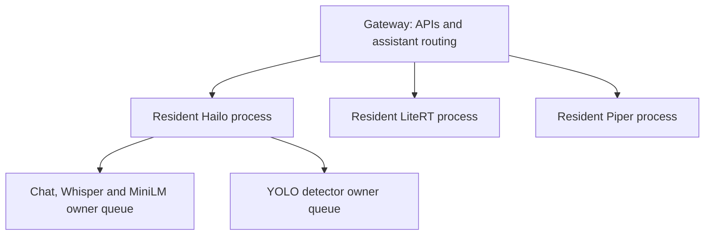

# Technical architecture and source map

Hailo-10H-Services keeps inference models resident and serves HTTP/OpenAI chat,
SSE, WebSocket, MCP, Wyoming, MQTT and Frigate ZeroMQ. Public contracts are in
[api.md](api.md); deployment is in [installation.md](installation.md).

## Packages and ownership

Paths are relative to `src/hailo_services/`. Each package has a short
`Readme.md` with its responsibilities and boundaries.

| Package | Responsibility |
| --- | --- |
| Package root | `__main__.py`, immutable settings, request schemas and backend interfaces; bundled model catalogue. |
| `api/` | ASGI composition, authentication, HTTP/SSE/WebSocket routes, MCP, Wyoming, MQTT and TLS tooling. |
| `assistants/ha/` | HA-Assist routing, exposed entity catalogue, HassIL/fuzzy recognition, request plans, state/weather answers, verification and compact prompts. |
| `assistants/frigate/` | Frigate-Assist recognition, time/camera resolution, tool planning, compact prompts and image-result validation. |
| `chat/` | Native Hailo and CPU LiteRT backends, common Hailo chat contracts and role-specific LLM/VLM adapters. |
| `speech/` | Whisper and Piper adapters, shared language selection and bounded TTS scheduling. |
| `vision/` | YOLO/NMS preprocessing, detector lifecycle and Frigate ZMQ transport. |
| `runtime/` | Async chat scheduling, backend/model lifecycle, model download/catalogue handling, MiniLM and preflight. |
| `runtime/workers/` | Resident child processes, IPC proxies, lifecycle supervision and cancellation forwarding. |
| `shared/` | Domain-independent tool/schema validation, budgets, JSON/media handling, HassIL primitives, retrieval and localization. |
| `diagnostics/` | Structured events, timing/token metrics, inline-data redaction and LiteRT instrumentation. |
| `locales/` | One JSON catalogue per language: replies, UI, labels, aliases, prompts and recognition resources. |
| `web/` | Browser playground, recording worklet, page markup and styles. |

Module basenames retain their role-specific names, for example
`assistants/ha/ha_assist.py`, `chat/backend_litert.py` and
`speech/speech_hailo_whisper.py`. Imports and deployment scripts use the new
package paths directly. The old flat modules and `_process` forwarding files
are removed rather than retained as compatibility layers.

Package initializers have no startup effects. Native SDK imports remain deferred
until their backend starts. Moving modules does not load additional model copies
or introduce additional devices. Model and web assets remain at the package root;
their readers resolve that location independently of their new package depth.

## Process and concurrency model

The command-line entry point uses process mode by default. `HAILO_PROCESS_MODE=0`
selects the owner-thread fallback. FastAPI/uvicorn still has one gateway worker;
multiplying web workers would duplicate model residency.

`api/process_app.py` injects runtime factories into `api/app.create_app()`.
It does not replace module-global classes. Creating a process-mode application
therefore cannot change a subsequently created threaded application. The process
supervisor shares the Hailo worker between chat/STT and the detector proxies.
Backend lifecycle reference counting retains that worker while either proxy uses it.

The Hailo process owns native Hailo resources, with separate chat and detector
owner executors. Chat/VLM/native LLM, Whisper and MiniLM preparation share the
chat owner queue; detection uses the detector owner queue. VDevices retain
`group_id=SHARED`. The resident native GenAI choice remains VLM **or** native
Hailo LLM; CPU LiteRT can run alongside either.

LiteRT and Piper each own a separate resident process and queue. Startup loads
Hailo models before CPU models. In the fallback, the same runtime contracts use
resident backends on their owner threads instead of IPC proxies. HTTP and Wyoming
share the same speech runtime, voice and capacity.

Queues and pending counters are bounded. Work remains charged to capacity until
native execution finishes, even after a timeout or client disconnect. Streaming
callbacks forward chunks with request IDs; tool calls are validated before being
returned. Child-process replies preserve request metrics and structured budget
errors. These boundaries reduce CPU/GIL interference; they do not remove shared
Hailo compute, RAM or queue contention. A long Hailo generation can still delay
Whisper or HA semantic preparation on the same chat owner queue. Frigate YOLO
has its own queue, but still shares physical accelerator resources.

## HA and Frigate isolation

The selected virtual model determines the domain pipeline. Domain requests have
their own history, catalogue, recognition trace and resolved facts. Neither
assistant imports the other assistant's modules.

| Shared mechanism | Domain boundary |
| --- | --- |
| HassIL parsing, grammar copying, slot lists and ambiguity bounds | HA loads official HA grammars restricted to client tools. Frigate loads its own JSON grammars. Slot lists are built per request. |
| Tool selection and JSON Schema/output validation | Calls may only name tools supplied by that client. HA target/value checks and name/area normalization run only with the explicit HA-Assist marker. Frigate separately validates camera IDs and resolved intervals. |
| Token budgets and whole-turn history handling | Each assistant prepares its own compact context; active tool dependencies and output constraints remain required. |
| Language catalogue and normalization | Language is request-local via `ContextVar`, or explicitly supplied to translation. HA vocabulary canonicalization never renames tool targets; Frigate matching preserves original camera IDs. |
| Native resident backends and bounded queues | Both assistants can use configured loaded models. Sharing model ownership is deliberate; it does not share domain state or tool permissions. |

Frigate requests pass through the common Hailo tool boundary unchanged by HA
stages because they lack HA-Assist provenance. The common tool validator's lazy
HA validation hook is gated by that same request marker. Completed HA actions,
verification retries and live-state results are interpreted only inside the HA
pipeline. A generic tool name or device word alone does not activate that pipeline.

Deterministic processing is an optimization, not a capability restriction.
Unmatched, ambiguous or compound requests continue to the configured model.
Explicit camera names and unambiguous time intervals can be resolved without
inference. Image-bearing turns retain actual image content. Neither assistant
executes client tool calls: HA or Frigate receives the validated call and performs
it. The service never claims a successful action without supplied evidence.

## Home Assistant preparation

`assistants/ha/ha_assist.py` validates the configured text/vision target and sets
HA provenance. Its preparation boundary invokes the following stages explicitly:

1. `ha_pipeline`: active history, catalogue preparation, language, safe numeric
   actions, HassIL recognition and request-plan validation.
2. `ha_weather_routing`: current ambient/weather queries and read-only lookups.
3. `ha_prompt_compiler`: run remaining stages and compile relevant context if
   inference is still needed.
4. `ha_action_verification`: retain live-state verification after completed actions.
5. `ha_state_routing`: direct state answers, GetLiveContext calls and live follow-ups.
6. `ha_routing`: relevance gating and general-conversation passthrough.
7. `HailoBackend.retrieve_context`: lexical/optional MiniLM entity/tool retrieval.

Stages accept `(backend, request, next_stage)`. They can finish early; compiler
and verification stages can also post-process fallback results. This preserves
precedence without monkey-patching backend methods. Verification preserves the
configured retry count and delay; state disagreement never silently becomes a
second control action.

## Frigate preparation

`assistants/frigate/frigate_assist.py` combines high-confidence HassIL recognition,
multilingual deterministic planning and conservative legacy/history handling.
`frigate_prompt.py` preserves image/task contracts while removing irrelevant generic
instructions. `frigate_routing.py` validates generated calls and damaged VLM output.
`frigate_context.py` is the single implementation for local timestamp parsing,
exact camera matching, active tool-result decoding and validated call construction.

Recognition grammars, lexical time units, labels and camera-feature synonyms come
from the locale catalogues. Per-language vocabulary is combined without changing
canonical Frigate labels or arguments. Time arithmetic uses Frigate's supplied
local server clock and retains local ISO timestamps. Missing or ambiguous context
can produce a clarification; unsupported deterministic forms retain model fallback.

## Language resources

Bundled languages are `de`, `en`, `ru`, `fr`, `es`, `it`, `nl` and `pt`.
`shared/i18n.py` discovers supported codes from `locales/*.json`, and the UI and
settings validation use that same list. Adding a catalogue does not require
editing a Python language allowlist. Resources are cached until service restart.

Each language file contains complete `text`, `ui`, `states`, `domains`, `weather`,
`wait`, `aliases`, `patterns`, `language_names`, `ha_intents` and `frigate` sections.
`frigate.sentences` contains HassIL forms; `frigate.vocabulary` maps localized words
to canonical concepts; `ha_intents.brightness` supplements the upstream grammar.
Response placeholders must have identical names in every language. `translate()`
accepts an explicit language; `t()` uses the current request language. Neither
explicit translation nor overlapping requests changes another request's context.

Model-facing Frigate instructions use an English technical contract where suitable
for small models, plus an explicit response-language instruction; the German vision
contract retains its established phrasing. These instructions are also JSON
resources, separate from localized user replies. JSON output examples escape braces
for formatting. Protocol markers, schema names, logs and developer errors remain
code contracts rather than translatable UI messages.

Legacy `routing` resources in `de.json` describe the canonical multilingual matching
representation, including older bilingual/history patterns. They are shared matching
rules, not German response translations; empty `routing` sections elsewhere do not
imply missing replies. New language recognition vocabulary belongs in that language's
aliases, Frigate vocabulary and sentence forms. Adding completely new behavior still
requires code; editing existing phrases and grammar forms only requires JSON.

## Chat contracts and budgets

`interfaces.py` defines resident backend contracts. The Hailo LLM and VLM adapters
share `chat/chat_common.py`: strict sandboxed prompt rendering, native token counts,
tool history, whole-turn trimming and validated output parsing. The VLM preserves
image placeholders; the LLM rejects images and uses the exact measured rendered
prompt without a second rendering.

LiteRT retains its native conversation/tool contract and exact prompt budgeting.
Its default input cap stays 4096. Required system/tool content and active tool rounds
are not truncated; `InputBudgetError` maps to a structured client error. Preparation
and output validation preserve explicitly forced tools and generation policies.

## Verification

The regression suite covers HA and Frigate independently, interleaved/parallel
localization, grammar/catalogue isolation, client schema boundaries, prompt budgets,
streaming, cancellation, model lifecycle and API protocols. Locale tests cover all
bundled languages, matching placeholder sets and resource-driven grammars. Python
and browser tests use fake SDK bindings; they do not establish hardware performance.
Lint, formatting and deployment shell checks accompany the test suite.
